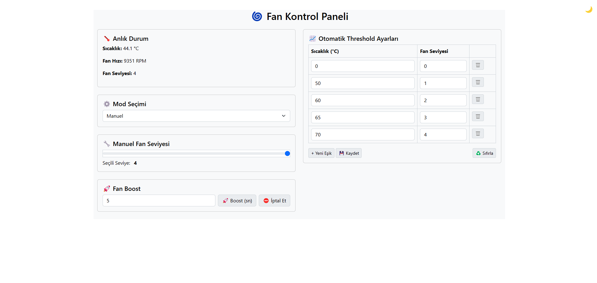
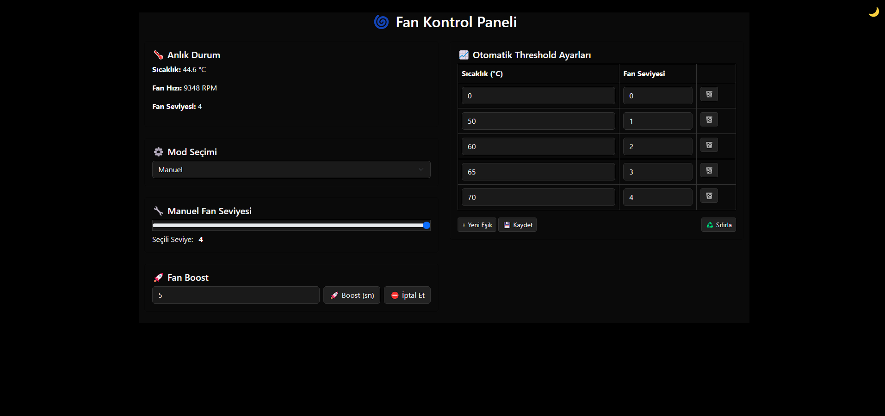

# Raspberry Pi 5 Fan Control Web Arayüzü

Bu proje, Raspberry Pi 5 üzerinde resmi aktif soğutucu (PWM fan) kullanılarak fan kontrolünü sağlayan bir web arayüzüdür. Fan hızını manuel olarak ayarlayabilir veya sıcaklık eşiklerine göre otomatik kontrol yapılandırabilirsiniz.

<p align="center">
  
</p>
<p align="center">
  
</p>

## 🚀 Özellikler

- Gerçek zamanlı sıcaklık takibi
- Manuel veya otomatik fan kontrolü
- Kullanıcı dostu web arayüzü
- Docker desteği ile kolay kurulum
- JSON tabanlı yapılandırma

## 🔧 Kurulum ve Çalıştırma

Uygulamayı iki farklı şekilde çalıştırabilirsiniz:

### 1. Doğrudan Python ile çalıştırma

> Python 3 ve Flask yüklü olmalıdır.

```bash
sudo python3 app.py
```

### 2. Docker ile çalıştırma

> Bu yöntem `--privileged` izniyle fan kontrolüne tam erişim sağlar.

```bash
docker run -d -p 5000:5000 \
  --name fan-control \
  --restart unless-stopped \
  -v /sys:/sys \
  --privileged \
  dikeckaan/pi5-fan-control-web:latest
```

Web arayüzüne tarayıcınızdan `http://<raspberry-pi-ip>:5000` adresi ile erişebilirsiniz.

## ⚙️ Yapılandırma

Tüm yapılandırmalar `config.json` dosyasında tutulur. Uygulama çalışırken bu dosya üzerinden:

- Otomatik fan kontrol eşikleri
- Başlangıç fan seviyesi

gibi ayarları düzenleyebilirsiniz.

## 📁 Dosya Yapısı

- `app.py` - Ana sunucu uygulaması
- `templates/index.html` - Web arayüzü şablonu
- `config.json` - Ayarlar
- `Dockerfile` & `docker-compose.yml` - Docker kurulumu için gerekli dosyalar
- `photo/` - Uygulamanın ekran görüntüleri
```
